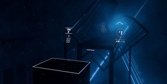
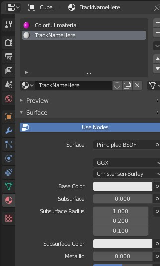
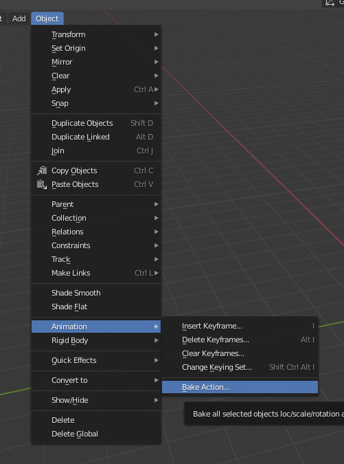
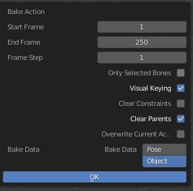
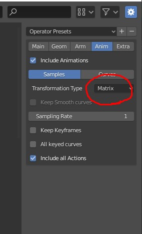

# Setting Up A Blender Project for Wall Conversion

All modeling done for wall conversion must be made up exclusively of 3d cubes (default cubes). Editing the mesh in any way won't affect the converted walls. The model must be exported in the Collada (.dae) format with +Y up +Z forwards global orientation. Each cube placed will be a wall

## Animating
Any animation on position, rotation, scale, viewport color and viewport visibility to a cube will show up in beatsaber. Shape Keys and other mesh deformations wont work.

## Animating Hide in Viewport & Color

Animating Hide Viewport will precisely fit the note/walls lifespan to fit the animation of the blender object visibility. For example, animating this property to disabled then re enabled 3 times would add 3 separate walls/notes, each spawning in and being destroyed exactly when animated in the viewport.

Animating the viewport color will animate the color of the wall/note

## Material "Tags"

Extra materials on objects are good for transfering arbitrary string data through a collada file.

Adding an extra material to a cube and naming it "Note" will make the model converter add a note instead of a wall where the cube is. Size, position, color and all other animations will be preserved.

This can also be used to create tracks. Adding an extra material to a cube and naming it anything other than Note will add that object onto a track with the name of the material.

## Bombs & Cameras

Spheres will be converted to bombs. Size, position, color and all other animations will be preserved.

Cameras will be converted to player tracks. Transform animations will be preserved.

##  Parenting and Baking

Parenting is a good way to get a collection of cubes in blender to all move together just by moving the reference object. In order to get scuffedwalls to pick up on the child cubes in your scene you must bake the children.

While selecting the children objects go to object, animation, bake action. Select visual keying and clear parents. This will automatically keyframe every child object to its visual position in the scene. It also clears all parents that the child objects may have had.

## Exporting

When going to export to collada hitting 'n' will bring up a collada settings menu. this is where you will choose the Y up Z forwards. check the global orientation box.

To ensure proper parsing check that 'Matrix' is the selected transformation type.

Sampling rate can be adjusted if the map file size becomes an issue.

## Importing

To make a 3d model in your map with scuffedwalls. Call the ModelToWall function. More info on the parameters can be found in [`here`](Functions.md)

HasAnimation: bool; this tells the model parser to read the model file as if it has an animation attached to it. It is enabled by default.

Normal: bool; makes the walls jump in and despawn as normal ne1.0 walls would. the proportions are preserved so overriding njs will change the amount of time it takes for the model finish being visible.

Normal:true will result in this from a static model with no animations

