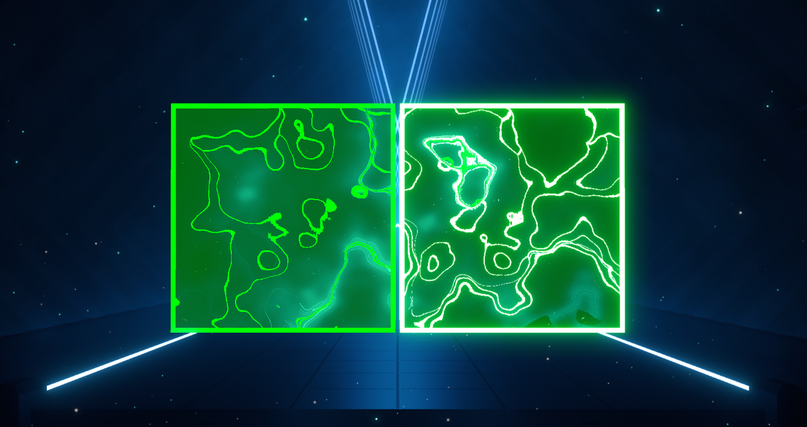
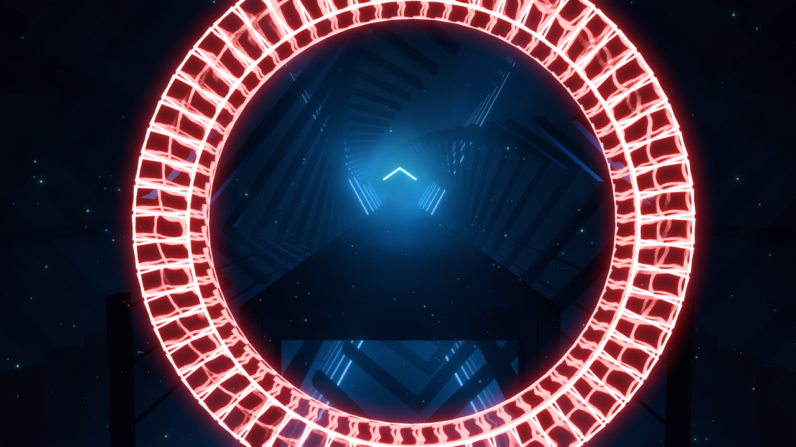

# Function Examples
A compilation of pre-made ScuffedWalls functions

## Complexity
 - [`Simple`](#Simple)
 - [`Medium`](#Medium)
 - [`Advanced`](#Advanced)

# Simple

### Large Alpha Values - useful to know

```ruby
# Left Side
1:Wall
   DefiniteDurationBeats:1
   Scale:[2,2,2]
   Position:[-2,2]
   AnimateDefinitePosition:[0,0,5,0],[0,0,5,1]
   Color:[0,2,0,-40]
   Interactable:false
# Right Side
1:Wall
   DefiniteDurationBeats:1
   Scale:[2,2,2]
   Position:[0,2]
   AnimateDefinitePosition:[0,0,5,0],[0,0,5,1]
   Color:[0,2,0,40]
   Interactable:false
```


### Add more tracks to objects - theligtdesibegh r
```ruby
0:AppendWalls
  track:["_track","newTrackToBeAdded"]
  appendtechnique:1
```
or
```ruby
0:AppendWalls
  track:["_track(0)","_track(1)","newTrackToBeAdded"]
  appendtechnique:1
```
# Medium

### Notes "walk" on their back quarters. looks best on bottom notes (needs to be slow NJS) - wobbleorange
 ```ruby
XXX:AppendToAllNotesBetween
   tobeat:XXX
   AnimatePosition:[-0.16,-0.2,0,0],[0,0,0,0.025],[0.16,-0.2,0,0.05],[0,0,0,0.075],[-0.16,-0.2,0,0.1],[0,0,0,0.125],[0.16,-0.2,0,0.15],[0,0,0,0.175],[-0.16,-0.2,0,0.2],[0,0,0,0.225],[0.16,-0.2,0,0.25],[0,0,0,0.275],[-0.16,-0.2,0,0.3],[0,0,0,0.325],[0.08,-0.2,0,0.35],[0,0,0,0.375]
   AnimateLocalRotation:[18,15,8,0],[18,-15,-8,0.05],[18,15,8,0.1],[18,-15,-8,0.15],[18,15,8,0.2],[18,-15,-8,0.25],[18,15,8,0.3],[18,-15,-8,0.35],[0,0,0,0.4]
   NJS:13
   NJSOffset:3
```
EXAMPLE: <https://cdn.discordapp.com/attachments/869471669356474408/897438240288702464/BloqWalkLFS.gif>


### Red bomb helix - totally balloon
```ruby
XXX:note
   repeat:120
   repeataddtime:0.05
   rotation:[0,0,{repeat*15}]
   position:[0,4,0]
   disableNoteGravity:true
   disableNoteLook:true
   fake:true
   interactable:false
   color:[1,0,0,1]
```
EXAMPLE: <https://cdn.discordapp.com/attachments/869471669356474408/897432477671497748/BloqSpinLFS.gif>

# Advanced

### Polygon Creator - iswimfly
```ruby
#CHANGEABLE!
var:sides
data:XXX

var:yPos
data:XXX

var:xPos
data:XXX

var:radius
data:XXX

#dont touch
var:LMAO
data:repeat-1
var:angles
data:3.14*2/sides
var:rot
data:360/sides*repeat
var:radians
data:angles*LMAO
var:width
data:2*radius*Tan(3.14/sides)
var:height
data:2
var:sx
data:xPos+Cos(radians)*radius-width/2
var:sy
data:yPos+Sin(radians)*radius-height/2

XXX:Wall
   repeat:{sides+1}
   localrotation:[0,0,{33.8+rot}]
   position:[{sx},{sy}]
    
   # CHANGE ANYTHING BELOW HERE AS YOU PLEASE! DO NOT TOUCH THE ABOVE!
   interactable: false
   duration:10
   scale:[6,1,1]
   animatedefiniteposition:[0,0,5,0],[0,0,5,1]
   animatecolor:[1,0,0,1,0.2],[1,1,0,1,0.4],[0,1,0,1,0.6],[0,1,1,1,0.8],[0,0,1,1,1]
```
EXAMPLE: <https://cdn.discordapp.com/attachments/869471669356474408/897438105873842216/CircleLFS.gif>


### Circle generator - iswimfly
 ```ruby
#The total amount of walls
var:amount
data:60

var:RepeatA
data:repeat-1

#Change to whatever you want, this just puts it roughly at the center
var:xPos
data:0
    
#Change to whatever you want, this just puts it roughly at the center
var:yPos
data:3

var:angle
data:3.14*2/amount

var:rot
data:360/amount*RepeatA
    
var:radians
data:angle*RepeatA

#Change to whatever you want
var:radius
data:10

var:width
data:2*radius*Tan(3.14/amount)

#Change to whatever you want, 2 is generally fine
var:height
data:2

var:sx
data:xPos+Cos(radians)*radius-width/2

var:sy
data:yPos+Sin(radians)*radius-height/2

#Change the scale to get different sized walls, X can increase the length of the walls
X:Wall
   repeat:{amount}
   interactable: false
   duration:10
   scale:[1,1,1]
   localrotation:[0,0,{33.8+rot}]
   position:[{sx},{sy}]
```


### Cube Generator - iswimfly
```ruby
# How long the Cube will stick around
var:duration
data:XXX

# Length of Each Wall
var:LWH
data:XXX

# How THICC you want the walls
var:THICK
data:XXX

# Center of the Cube on the X Axis
var:CenterX
data:XXX

# Center of the Cube on the Y Axis
var:CenterY
data:XXX

# Center of the Cube on the Z Axis
var:CenterZ
data:XXX

# Right Square Set One
X:Wall
    duration:duration
    repeat:2
    scale:[THICK,{if(repeat = 1, LWH, LWH-THICK)},THICK]
    localrotation:[{90*(repeat-1)},0,0]
    animatedefiniteposition:[{CenterX-(LWH/2)+THICK/2},{CenterY/2-(LWH/2)},{CenterZ/2+(LWH/2)-(THICK*2)},0]

# Right Square Set Two
X:Wall
    duration:duration
    repeat:2
    scale:[THICK,{if(repeat = 1, LWH, LWH-THICK)},THICK]
    localrotation:[{90*(repeat+1)},0,0]
    animatedefiniteposition:[{CenterX-(LWH/2)+THICK/2},{CenterY/2+(LWH/2)},{CenterZ/2-(LWH/2)},0]

# Left Square Set One
X:Wall
    duration:duration
    repeat:2
    scale:[THICK,{if(repeat = 1, LWH, LWH-THICK)},THICK]
    localrotation:[{90*(repeat-1)},0,0]
    animatedefiniteposition:[{CenterX+(LWH/2)-THICK/2},{CenterY/2-(LWH/2)},{CenterZ/2+(LWH/2)-(THICK*2)},0]

# Left Square Set Two
X:Wall
    duration:duration
    repeat:2
    scale:[THICK,{if(repeat = 1, LWH, LWH-THICK)},THICK]
    localrotation:[{90*(repeat+1)},0,0]
    animatedefiniteposition:[{CenterX+(LWH/2)-THICK/2},{CenterY/2+(LWH/2)},{CenterZ/2-(LWH/2)},0]

# Connecting Edges

#Back Bottom
X:Wall
    duration:duration
    scale:[THICK,LWH,THICK]
    localrotation:[180,0,270]
    animatedefiniteposition:[{CenterX-(LWH/2)},{CenterY/2-(LWH/2)+THICK/2},{CenterZ/2+(LWH/2)-THICK},0]

#Back Top
X:Wall
    duration:duration
    scale:[THICK,LWH,THICK]
    localrotation:[180,0,270]
    animatedefiniteposition:[{CenterX-(LWH/2)},{CenterY/2+(LWH/2)-THICK/2},{CenterZ/2+(LWH/2)-THICK},0]

#Front Bottom
X:Wall
    duration:duration
    scale:[THICK,LWH,THICK]
    localrotation:[180,0,270]
    animatedefiniteposition:[{CenterX-(LWH/2)},{CenterY/2-(LWH/2)+THICK/2},{CenterZ/2-(LWH/2)},0]

#Front Top   
X:Wall
    duration:duration
    scale:[THICK,LWH,THICK]
    localrotation:[180,0,270]
    animatedefiniteposition:[{CenterX-(LWH/2)},{CenterY/2+(LWH/2)-THICK/2},{CenterZ/2-(LWH/2)},0]
```

