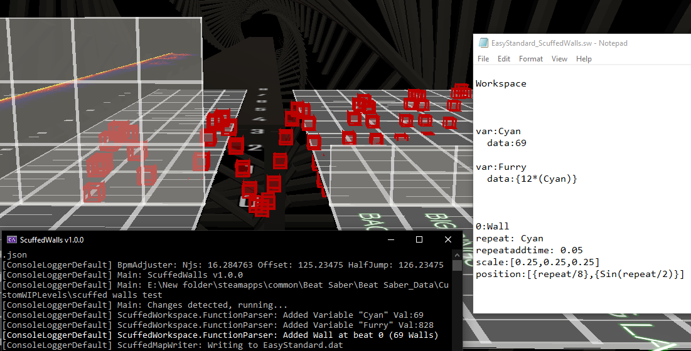

## Contents
 - [`Overview`](#Overview)
 - [`Functions`](#Functions)
 - [`Workspaces`](#Workspaces)
 - [`Custom Functions Overview`](#custom-functions-basics)
 - [`Custom Functions Features`](#custom-functions-features)
 - [`Noodle Extensions/Chroma Properties Syntax`](#noodle-extensionschroma-properties-syntax)
 - [`Math & Functions`](#math--functions)
 - [`Variables`](#Variables)
 - [`Internal Variables`](#internal-variables)
 - [`Example Functions`](#Example-Functions)

## Overview

Everything in this section of the docs is referenced in the \_ScuffedWalls.sw file generated by the program. You can edit this file with the IDE of your choice.

# Functions

Functions in ScuffedWalls are always called by stating a time value and the name of the function. Some functions do not use their time values, for those you can set the value to 0. In the lines beneath the function call, you can add parameters. Every parameter beneath a function call will apply only to that function.

example:

[//]: # (I Added ruby syntax highlighing to commands, its not perfect but its still nicer to read than pure white -UPDATE- nvm its just a bug with my vsc plugin, looks fine on github) 
```ruby
Workspace <- workspace

0:Wall <- function call
  color:[0,1,1,1] <- parameter ^ Wall
  scale:[1,1,1] <- parameter ^ Wall
  
var:Variable <- variable instance
  data:2 <- parameter ^ Variable
```

All the available functions are listed below

- [`AppendWalls`](#AppendWalls)
- [`AppendNotes`](#AppendNotes)
- [`AppendEvents`](#AppendEvents)
- [`TextToWall`](#TextToWall)
- [`ModelToWall`](#ModelToWall)
- [`ImageToWall`](#ImageToWall)
- [`Environment`](#Environment)
- [`Blackout`](#Blackout)
- [`Import`](#Import)
- [`Run`](#Run)
- [`Wall`](#Wall)
- [`Note`](#Note)
- [`AnimateTrack`](#AnimateTrack)
- [`AssignPathAnimation`](#AssignPathAnimation)
- [`AssignPlayerToTrack`](#AssignPlayerToTrack)
- [`ParentTrack`](#ParentTrack)
- [`PointDefinition`](#PointDefinition)

# Workspaces

Generally, a function will only add or affect map objects (walls, notes, lights, ect) in its own workspace.

Every workspace is combined when writing to the map file

Workspaces are usefull for organization, cloning and appending

Examples
```ruby
Workspace: Workspace 1

1:Note

Workspace: A Different Workspace

2:Note

0:AppendNotes
#Affects Note 2 but not Note 1
```
```ruby
Workspace: Workspace 1

1:Note

Workspace: A Different Workspace

2:Note

Workspace: Clone Workspace 1

0:CloneWorkspace
Name: Workspace 1

#This workspace has a clone of Note 1 in it
```
```ruby
Workspace: Workspace 1

var:Three
  data:3
  
1:Note
  NJS:Three
  #This works because the variable is declared in this workspace

Workspace: A Different Workspace

2:Note
  NJS:Three
  #This will not work
  
```

# Custom Functions Basics
A custom function is a `workspace` that can be instantiated multiple times.

You can define a custom function by using the keyword `function` in place of `workspace`

Example
```
Function: SpinWall

  0:Wall
    duration:5 
    animateLocalRotation:[0,0,0,0],[0,0,180,1]

```
Defines a custom function which adds one wall with some properties. **Note: this does nothing on its own.**

To use this custom function you can reference it like a regular function.

Example
```
Workspace

  0:SpinWall

```

# Custom Functions Features
CFs have the ability to set variabels as public. Meaning you can change the variables data from outside the CF.

Example
```
Function: OhWow

Var: AmazingVariableName
  data: hi retrx!
  public:true

0:Log
  Log:AmazingVariableName

Workspace

0: OhWow
  AmazingVariableName: bye retrx :(

```
This example prints to the console: `bye retrx :(`

CFs also have the ability to set a function call to the time that the CF was called from.

Example
```
Function: NeatO

XXX:Wall

Workspace

7.2: NeatO

```
This example adds a wall at beat 7.2

Practical use example:

cleaning up text to wall
```
function:Subtitle

var:line
  data:????
  public:true

  
var:duration
  data:1
  public:true

xxx:texttowall
  definitedurationbeats:duration
  Path:font.dae
  line:line
  letting:2
  leading:-1
  thicc:12
  spreadspawntime:1
  size:0.1
  position:[0,2]
  animatedefiniteposition:[0,0,0,0]

workspace:text

5.25:Subtitle
  line:You know you gotta...
  duration:1.25

  
6.5:Subtitle
  line:TRY
  duration:8

```

# Noodle Extensions/Chroma Properties Syntax
Noodle Extensions/Chroma/Other properties that can be used on most functions

Most of these properties are directly connected to their corresponding Noodle/Chroma property written in JSON. 

(`""` = put in quotes, `?` = optional)

[`Notes and Obstacles`](https://github.com/Aeroluna/Heck/wiki/Objects#notes--obstacles)
- NJSOffset: float
- NJS: float
- Interactable: bool
- Fake: bool
- Position: \[x,y]
- Rotation: \[x,y,z] or float
- LocalRotation: \[x,y,z]

[`Notes`](https://github.com/Aeroluna/Heck/wiki/Objects#notes)
- CutDirection: float
- DisableNoteGravity: bool
- DisableNoteLook: bool

[`Obstacles`](https://github.com/Aeroluna/Heck/wiki/Objects#obstacles)
- Scale: \[x,y?,z?]

[`Tracks`](https://github.com/Aeroluna/Heck/wiki/Animation#tracks)

- Track: string, or \["t1","t2"...] for multiple tracks
- [`AnimateDefinitePosition`](https://github.com/Aeroluna/Heck/wiki/AnimationProperties#_definiteposition): \[x,y,z,t,"e"?]
- [`AnimatePosition`](https://github.com/Aeroluna/Heck/wiki/AnimationProperties#_position): \[x,y,z,t,"e"?]
- [`AnimateDissolve`](https://github.com/Aeroluna/Heck/wiki/AnimationProperties#_dissolve): \[d,t,"e"?]
- [`AnimateDissolveArrow`](https://github.com/Aeroluna/Heck/wiki/AnimationProperties#_dissolvearrow): \[d,t,"e"?]
- [`AnimateColor`](https://github.com/Aeroluna/Heck/wiki/AnimationProperties#_color): \[r,g,b,a,t,"e"?]
- [`AnimateRotation`](https://github.com/Aeroluna/Heck/wiki/AnimationProperties#_rotation): \[x,y,z,t,"e"?]
- [`AnimateLocalRotation`](https://github.com/Aeroluna/Heck/wiki/AnimationProperties#_dissolve): \[x,y,z,t,"e"?]
- [`AnimateScale`](https://github.com/Aeroluna/Heck/wiki/AnimationProperties#_scale): \[x,y,z,t,"e"?]
- [`AnimateInteractable`](https://github.com/Aeroluna/Heck/wiki/AnimationProperties#_interactable):\[i,t]
- [`AnimateTime`](https://github.com/Aeroluna/Heck/wiki/AnimationProperties#_time):\[t,t,"e"?]

[`Chroma`](https://github.com/Aeroluna/Heck/wiki/Objects#chroma)

 - Color: \[r,g,b,a] (0-1)
 - RGBColor:\[r,g,b,a] (0-255)
 - DisableSpawnEffect: bool
 - CPropID: int
 - CLightID: int
 - CGradientDuration: float
 - CgradientStartColor: \[r,g,b,a?]
 - CgradientEndColor: \[r,g,b,a?]
 - CgradientEasing: string
 - CLockPosition: bool
 - CPreciseSpeed: float
 - CDirection: int
 - CNameFilter: string
 - CReset: bool
 - CStep: float
 - CProp: float
 - CSpeed: float
 - CCounterSpin: bool

`Other`
 - Log: prints things to the console. useful for checking the value of internal variables. ex: `Log:hi retrx!`
 - \#  is used at the start of a blank line for a comment

Useful links
 - [`Heck Documentation`](https://github.com/Aeroluna/Heck/wiki)

Additional Info

### Position
> x = **left-right**, y = **up-down**, z = **forward-backward** 

> 0,0,0  Is on the ground in the center of the lanes
### Scale Walls

> x = **width** extending from the right, y = **hight** extending from the top , z = **length** extending from the back

### Time Notes

> t = **time of any given animation event**, relative to the object duration (0.0 - 1.0)

> t 0.5 = halfway through the objects lifetime,

# Math & Functions
Math expressions are computed inside of { } symbols. A random floating point number is yielded from the function `Random(val1,val2)`. A random integer is yielded from the line function `RandomInt(val1,val2)`.

```ruby
0:Wall
  position:[{ 5+6 }, Random(1,5), { 5+6+Random(2,10) }]
  scale:[RandomInt(5,0),RandomInt(5,0),RandomInt(5,0)]
  ```

```ruby
0:Wall
  repeat:100
  position:[{repeat/10},0,0]
  scale:[0.1,1,1]
  color:HSLtoRGB({repeat/100},1,0.5)
  ```
  

  
The example above uses the HSLtoRGB function to create a rainbow.

The available functions are:
 - Random(Val1,Val2) => returns a number
 - RandomInt(Val1,Val2) => returns a number
 - HSLtoRGB(Hue,Saturation?,Lightness?,Alpha?,Any extra values like easings or whatever?) => returns a point definition
 - MultPointDefinition(PointDefinition,value to multiply) => returns a point definition
 - RepeatPointDefinition(PointDefinition,amount of times to repeat) => returns point definitions
 - OrderPointDefinitions(PointDefinitions) => returns point definitions

## Random & RandomInt
An inline function that returns a random number ranging from Val1 to Val2. RandomInt will return a random whole number.

Example:
```ruby
0:wall
  njs:Random(0,10)
```

## HSLtoRGB
An inline function that returns a point definition representing a color.

HSLtoRGB(Hue, Saturation, Value, Alpha?, Extra values to be added to the point defintion?)

Examples:
```ruby
0:Wall
  color:HSLtoRGB(0.2,1,0.5,1)
```
```ruby
0:Wall
  animatecolor:HSLtoRGB(0.2,1,0.5,1,0),HSLtoRGB(0.4,1,0.5,1,1,"easeInOutSine")
  #			^   ^  ^  ^ ^   	 ^  ^  ^  ^ ^        ^
  #		     hue,sat,val,alfa,time 	hue,sat,val,alfa,time,easing
```

## RepeatPointDefinition
An inline function that returns a controllable amount of point definitions based on one or more point definitions.

This function has an internal variable `reppd` (short for repeatpointdefinition) which ticks up every repeat.

Example:
```ruby
0:Note
  animateposition:RepeatPointDefinition([Random(0,1),Random(0,1),Random(0,1),{reppd/9}],10)
```

## OrderPointDefinitions
An inline function that returns point definitions ordered by their time value.

```ruby
0:Wall
  animatedissolve:OrderPointDefinitions([1,1],[1,0],[1,0.2],[1,0.8])
```

## MultPointDefinition
An inline function that multiplies all numbers in a point definition by another number.

```ruby
0:AppendWalls
  color:MultPointDefinition([_color(0),_color(1),_color(2),_color(3)],2)
```

# Variables
Variables are containers for string/numerical data.

```ruby
Workspace

var:SomeVariableName
  data:5
  recompute:0

0:Wall
  NJS:SomeVariableName
  ```

  ```ruby
Workspace

  var:Grey
  data:Random(0,1)
  recompute:1

  #Creates walls with random shades of grey
0:Wall
  color:[Grey,Grey,Grey,1]
  repeat:15
  ```
  
Variables are only accessable from the workspace they are defined in.

recompute:
 - 0 = recompute math, variables and random() for all references of the variable, 
 - 1 = recompute every repeat/function, 
 - 2 = compute once on creation
defaults to 2

# Internal Variables
Variables that are auto created and changed internally. All repeatable functions will have at least 2 internal variables called "repeat" and "time". The append function populates all the properties of each wall/note/event as a variable.

```ruby
0:Wall
  repeat:60
  repeataddtime:0.05
  scale:[0.25,0.25,0.25]
  position:[{repeat/8},{Sin(repeat/2)}]
  ```




## AppendWalls

Appending means to add on or to merge two sets of data. The append function will loop through a set of map objects and merge all properties as specified.

 - Function Time => starting beat of selection (only append notes after...)
 - toBeat: float => ending beat of selection (only append notes before...)
 - appendTechnique: int(0-2)
 - select: bool, only applies the affect if the value is true. example `select:{_lineLayer = 0}` will only append to walls with linelayer 0
 - any of [`these properties`](Functions.md#noodle-extensionschroma-properties-syntax)
 
  Example
 ```ruby
 5:AppendToAllWallsBetween
   toBeat:10
   track: FurryTrack
   appendTechnique:1
 ```


multiplies all the wall times by 2
```ruby
0:AppendWalls
   time:{_time * 2}
   appendtechnique:1
```

multiplies all the definitepositions by 3 except for the time value
```ruby
0:AppendWalls
   animateDefinitePosition:[{_animation._definitePosition(0)(0) * 3},{_animation._definitePosition(0)(1) * 3},{_animation._definitePosition(0)(2) * 3},_animation._definitePosition(0)(3)]
   appendtechnique:1
```
   
a very scuffed way to make a rainbow


[`a less scuffed way to make a rainbow`](Functions.md#math--functions)

## AppendNotes
Appends data to notes between the function time and endtime (toBeat)

 - Function Time => starting beat of selection (only append notes after...)
 - toBeat: float => ending beat of selection (only append notes before...)
 - appendTechnique: int(0-2)
 - select: bool, only applies the affect if the value is true. example `select:{_lineLayer = 0}` will only append to notes with linelayer 0
 - any of [`these properties`](Functions.md#noodle-extensionschroma-properties-syntax)
 
  Example
```ruby
5:AppendToAllNotesBetween
  toBeat:10
  track: FurryTrack
  appendTechnique:2

60:AppendToAllNotesBetween
  tobeat:63
  Njsoffset:Random(1,3)
  AnimatePosition:[Random(-7,6),Random(-6,6),0,0],[0,0,0,0.35,"easeOutCubic"],[0,0,0,1]
  AnimateDissolve:[0,0],[1,0.1],[1,1]
  DisableSpawnEffect:true

66:AppendToAllNotesBetween
  tobeat:99
  NJS:10
  DisableSpawnEffect:true
  AnimateDissolveArrow: [0,0],[0,1]
  track:CameraMoveNotes
```

multiplies all the note times by 2

```ruby
0:AppendNotes
   time:{_time * 2}
   appendtechnique:1
```

multiplies all the definitepositions by 3 except for the time value
```ruby
0:AppendNotes
   animateDefinitePosition:[{_animation._definitePosition(0)(0) * 3},{_animation._definitePosition(0)(1) * 3},{_animation._definitePosition(0)(2) * 3},_animation._definitePosition(0)(3)]
   appendtechnique:1
   ```

## AppendEvents
Appends data to events between the function time and endtime (toBeat)

 - toBeat: float
 - appendTechnique: int(0-1)
 - any of [`these properties`](Functions.md#noodle-extensionschroma-properties-syntax)
 - selecttype: 0, 1, 2, 3; the type of the light to append to

 Example
```ruby
 5:AppendToAllEventsBetween
   toBeat:10
   appendTechnique:2
   selectType:1,3,0
   color:HSLtoRGB(time, 1, 0.5, 1)
```

 ## AppendTechnique
The merge priority of the values being appended
 - 0 = Low Priority, Will not overwrite any property but can still append to nulled properties (default)
 - 1 = High Priority, Can overwrite any property

## Append Function Internal Variables
The append function runs through each object in a workspace and changes its data.

In the example, `animateDefinitePosition:[{_animation._definitePosition(0)(0) * 3}...]`

`_animation._definitePosition(0)(0)` is a reference to an "internal" variable created by the append function. in the case of SW, indexers are represented with parenthesis.


this example takes the value from the already existing  `_definitePosition` array, indexes in to the first array of the point definition, then indexes in again into the first value of the array, multiplies the resulting floating point number by 3, and then sets that.

granted this only works if every object has a  `_definitePosition` with a value at the specified index

confusing right?


## TextToWall
Constructs text out of walls

Rizthesnuggies [`Intro to TextToWall`](https://www.youtube.com/watch?v=g49gfMtzETY) tutorial

see [here](TextToWall.md) for how the program reads font images/models.

 - path: string
 - fullpath string
 - refreshonsave: bool, refreshes scuffedwalls when the file at the specified path is modified
 - line: string, the text you want to convert to walls. [this can be repeated](Images/linetext.jpg) to add more lines of text.
 - letting: float, the relative space between letters. default: 1
 - leading: float, the relative space between lines. default: 1
 - size: float, scales the text. default: 1 (gigantic)
 - thicc: float, makes the edges of the walls fill more of the center
 - duration: float
 - definitedurationbeats: float, makes the walls stay around for exactly this long in beats
 - definitedurationseconds: float, makes the walls stay around for exactly this long in seconds
 - definitetime: beats/seconds, makes the walls jump in at exactly the function time in seconds or beats
 - Position => moves the text by this amount, defaults to \[0,0]
 - all the other imagetowall params if your really interested
 - all the other modeltowall params if your really interested
 - any of [`these properties`](Functions.md#noodle-extensionschroma-properties-syntax)
 
 Example
 ```ruby
 5:TextToWall
   Path:font.dae
   line:a line of text!
   line:another line of text?
   letting:2
   leading:-1
   thicc:12
   spreadspawntime:1
   size:0.1
   position:[0,2]
   animatedefiniteposition:[0,0,0,0]

#makes the text jump in at beat 5 and exist for 7 beats exactly
   definitedurationbeats:7
   definitetime:beats
```

## ModelToWall

(repeatable)
constructs a model out of walls. see [here](Blender%20Project.md) for more info

Rizthesnuggies [`Intro to ModelToWall`](https://youtu.be/FfHGRbUdV_k) tutorial


 - path: string
 - fullpath: string 
 - refreshonsave: bool, refreshes scuffedwalls when the file at the specified path is modified
 - hasAnimation: bool, tells the model parser to read animation. definite only
 - duration: float, controls the duration of the model. this affects the length of time it takes to play the model animation.
 - definitedurationbeats: float, makes the walls stay around for exactly this long in beats
 - definitedurationseconds: float, makes the walls stay around for exactly this long in seconds
 - definitetime: beats/seconds, makes the walls jump in at exactly the function time in seconds or beats
 - spreadspawntime: float
 - Normal: bool, makes the walls jump in and fly out as normal. essentially 1.0 model to wall when set to true. default: false
 - createtracks: bool
 - colormult: float, multiplies all the model color values by this amount
 - preservetime: bool
 - cameratoplayer: bool
 - createnotes: bool
 - spline: bool
 - spreadspawntime: float
 - type: 0, 1, 2 or 3, 0 = ModelDefined, 1 = AllWalls,  2 = AllBombs, 3 = AllNotes
 - alpha: float
 - thicc: float
 - deltaposition: \[x,y,z] offsets the model in 3d by this position vector
 - deltarotation: \[x,y,z] rotates the model around the center of its bounding box
 - deltascale: float, scales the model around the center of its bounding box
 - setdeltaposition: bool
 - setdeltascale: bool
 - any of [`these properties`](Functions.md#noodle-extensionschroma-properties-syntax)
 - repeat: int
 - repeataddtime: float
 
 
  Example
```ruby
 5:ModelToWall
   Path:model.dae
   hasAnimation:false
   spreadspawntime:1
   normal:true
   track:FurryTrack

#makes the model jump in at beat 5 and last for 5.1276 seconds exactly
   definitetime:beats
   definitedurationseconds:5.1276
```

## ImageToWall
(Only works on versions less than v2.0.0)

Constructs an image out of walls as pixels

Rizthesnuggies [`Intro to ImageToWall`](https://youtu.be/Cxbc4llIq3k) tutorial

 - path: string
 - fullpath string
 - refreshonsave: bool, refreshes scuffedwalls when the file at the specified path is modified
 - isBlackEmpty: bool, doesn't add pixel if the pixel color is black. default: false
 - size: float, scales the image. default: 1
 - thicc: float, makes the edges of the walls fill more of the center
 - centered: bool, centers the x position. default: false
 - duration: float  
 - definitedurationbeats: float, makes the walls stay around for exactly this long in beats
 - definitedurationseconds: float, makes the walls stay around for exactly this long in seconds
 - definitetime: beats/seconds, makes the walls jump in at exactly the function time in seconds or beats
 - spreadspawntime: float. default: 0
 - maxlinelength: int, the max line length. default: +infinity
 - shift: float, the difference in compression priorities between the inverted compression. default: 1
 - compression: float, how much to compress the wall image, Not linear in the slightest. recommended value(0-0.1) default: 0
 - Position => moves each pixel by this amount, defaults to \[0,0]
 - Alpha: the alpha value
 - any of [`these properties`](Functions.md#noodle-extensionschroma-properties-syntax)
 
  Example
```ruby
 5:ImageToWall
   Path:image.png
   thicc:12
   size:0.5
   isBlackEmpty: true
   centered: true
   maxlinelength:8
   compression:0.1
   spreadspawntime:1
   position:[0,2]
   duration:12
   animatedefiniteposition:[0,0,0,0]
```
 
## Environment

makes a chroma environment enhancement, idk what this does but i heard [`its pretty cool`](https://github.com/Aeroluna/Chroma#environment-enhancement)

(Airscrach) This Took Me An Entire Day To Figure Out So Heres A [`Quickstart Guide`](Environment%20Id%20Quick%20Guide.md)

- id: string
- track: string
- lookupmethod: string
- duplicate: int
- active: bool
- scale: \[x,y,z]
- localposition: \[x,y,z]
- localrotation: \[x,y,z]
- position: \[x,y,z]
- rotation: \[x,y,z]

  Example
```ruby
1:Environment
    id:^BigMirrorEnvironment\.\[0]Environment\.\[18]DoubleColorLaser$
    lookupMethod:Regex
    position:[8,1.667,39]
    track:DoubleColorLaser
    active:true
    
    #takes the double color laser and changes position and adds it to a track
```

## Blackout
adds a single light off event at the beat number. why? because why not.

 Example
```ruby
 5:Blackout
```
 
 
# Run
> "Run", "cmd", "Terminal", "Execute"

calls the terminal/command prompt and runs the specified args after or before the programs runtime.

also can run javascript files

 - args: string, this is what will be put into the terminal
 - runbefore: bool, (if true) will execute this function before SW begins to parse the .sw file, when false this function runs after SW finishes writing to the map file
 - javascript: string, path to the .js file, will execute this file using the node command
 - refreshonsave: bool, refreshes scuffedwalls when the javascript file is modified

```ruby
0:Run
  Javascript:CoolMapScript.js
  RunBefore: false
```
note that in the above example, CoolMapScript.js is in the map folder

```ruby
0:Run
  Args:Start Notepad.exe
  RunBefore: false
```

Example js script for mapping -> [`here`](https://github.com/TzurS11/NoodleScript)
 
## Import
adds in map objects from other map.dat files

 - path: string
 - fullpath string
 - refreshonsave: bool, refreshes scuffedwalls when the file at the specified path is modified
 - type:int,int,int (defaults to 0,1,2,3) what to import where 0 = walls, 1 = notes, 2 = lights, 3 = customevents & point definitions
 - addtime:float
 - toBeat: float
 
  Example: adds lights from EasyStandard.dat from beat 15 to beat 180
```ruby
 15:Import
   fullpath:E:\New folder\steamapps\common\Beat Saber\Beat Saber_Data\CustomWIPLevels\scuffed walls test\EasyStandard.dat
   type:2
   toBeat:180
```

## Wall
(repeatable)
makes a wall

Rizthesnuggies [`Intro to Wall & Note`](https://youtu.be/hojmJ1UZcb8) tutorial

- duration: float
- definitedurationbeats: float, makes the walls stay around for exactly this long in beats
- definitedurationseconds: float, makes the walls stay around for exactly this long in seconds
- definitetime: beats/seconds, makes the walls jump in at exactly the function time in seconds or beats
- repeat: int, amount of times to repeat
- repeatAddTime: float
- any of [`these properties`](Functions.md#noodle-extensionschroma-properties-syntax)

 Example
```ruby
#blue fire
5:Wall
  repeat:160
  repeataddtime:0.2
  NJSOffset:-10
  animatedefiniteposition:[Random(0,2),Random(8,12),Random(28,31),0],[Random(-7,-4),Random(10,14),Random(28,31),1,"easeInSine"]
  animatescale:[1,1,1,0],[0.01,0.01,0.01,1,"easeInSine"]
  scale:[0.8,0.8,0.8]
  color:[0,Random(1.6,1.7),Random(1.9,2),2]
  localrotation:[Random(0,360),Random(0,360),Random(0,360)]
  rotation:[0,0,-5]
  track:flowerfloat
  animatedissolve:[0,0],[1,0],[1,0.9],[0,1]

#shooting star
164:Wall
  repeat:50
  repeataddtime:0.4
  scale:[0.2,0.2,18]
  Njs:10
  NjsOffset:20
  position:[Random(0,80),Random(-100,100)]
  color:HSLtoRGB(Random(0,1),1,0.5,1)
  rotation:[Random(0,360),90,0]
```

## Note
(repeatable)
makes a note

While it is possible, ScuffedWalls does not serve as a usable alternative to note mapping. The `Note` function is recommended for creating procedural effects only.

Rizthesnuggies [`Intro to Wall & Note`](https://youtu.be/hojmJ1UZcb8) tutorial

- repeat: int, amount of times to repeat
- repeatAddTime: float
 - any of [`these properties`](Functions.md#noodle-extensionschroma-properties-syntax)
- type:int
- cutDirection:int


these properties use \_noteJumpStartBeatOffset to adjust the notes duration

 - definitedurationbeats: float, makes the note stay around for exactly this long in beats
 - definitedurationseconds: float, makes the note stay around for exactly this long in seconds
 - definitetime: beats/seconds, makes the note jump in at exactly the function time in seconds or beats

 Example
```ruby
#Note fire
100:Note
  repeat:66
  repeatAddTime:0.3
  localRotation:[Random(0,360),Random(0,360),Random(0,360)]
  Rotation:[90,0,0]
  Position:[Random(-12,-6),Random(8,18)]
  AnimatePosition:[0,0,-10,0],[0,0,-10,1]
  AnimateDissolve:[0,0],[1,0.1],[1,1]
  AnimateScale:[2,2,2,0],[2,2,2,1]
  AnimateColor:[1, 0, 0, 1,0], [0, 1, 0, 0.5, 0.0832], [0, 0, 1, 1, 0.15], [1, 0, 0, 1, 0.23], [0, 1, 0, 1, 0.30], [0, 0, 1, 1, 0.38], [1, 0, 0, 1, 0.45], [0, 1, 0, 1, 0.52],     [0, 0, 1, 1, 0.60], [1, 0, 0, 1, 0.68], [0, 1, 0, 1, 0.75], [0, 0, 1, 1, 0.84],[1,1,1,1,1]
  NJS:10
  NJSOffset:4
  fake:true
  Interactable: false
  track: RandomShit
```


## AnimateTrack
(repeatable)
makes an [`AnimateTrack`](https://github.com/Aeroluna/NoodleExtensions/blob/master/Documentation/AnimationDocs.md#AnimateTrack) custom event

 - any of [`these properties`](Functions.md#noodle-extensionschroma-properties-syntax)
 - easing: string
 - repeat: int, amount of times to repeat
 - repeatAddTime: float
 
  Example
 ```ruby
70:AnimateTrack
  track:RandomShit
  duration:1
  animatedissolve:[0,0],[0,1]
  animatedissolvearrow:[0,0],[0,1]
  
100:AnimateTrack
  track:RandomShit
  duration:1
  animatedissolve:[0,0],[1,1]
  animatedissolvearrow:[0,0],[1,1]
```

# AssignPathAnimation
(repeatable)
makes an [`AssignPathAnimation`](https://github.com/Aeroluna/NoodleExtensions/blob/master/Documentation/AnimationDocs.md#AssignPathAnimation) custom event

 - any of [`these properties`](## Noodle Extensions/Chroma Properties Syntax)
 - track: string
 - easing: string
 - repeat: int, amount of times to repeat
 - repeatAddTime: float
 
  Example
```ruby
42:AssignPathAnimation
  track:BeginningStretch
  duration:8
  AnimateRotation:[0,0,0,0],[0,0,0,0.5,"easeOutQuad"],[0,0,0,1]
  easing:easeInOutSine
```

## AssignPlayerToTrack
makes an [`AssignPlayerToTrack`](https://github.com/Aeroluna/NoodleExtensions/blob/master/Documentation/AnimationDocs.md#AssignPlayerToTrack) custom event

 - any of [`these properties`](Functions.md#noodle-extensionschroma-properties-syntax)
 - track: string
 - easing: string
 
  Example
```ruby
 3:AssignPlayerToTrack
    track:BigMovement
```

# ParentTrack
makes an [`AssignTrackParent`](https://github.com/Aeroluna/NoodleExtensions/blob/master/Documentation/AnimationDocs.md#AssignTrackParent) custom event

 - childTracks:\["str","str"...]
 - parentTrack: string
 
  Example
```ruby
 3:ParentTrack
    ParentTrack:BigMovement
    ChildTracks:["rightnotes","leftnotes"]
```

## PointDefinition
makes a point definition for use with custom events
  - name: string
  - points: point definitions

  Example
```ruby
  5:PointDefinition
    name:UpDownPoints
    points:[0,0,0,0],[0,15,0,0.5,"easeInOutSine"],[0,0,0,1,"easeInOutSine"]

  15:Wall
    DefineAnimateDefinitePosition:UpDownPoints
```

## Script
use this function by downloading the repo and navigating to ScuffedWalls>Program>Functions>Script.cs

is this stupid? yes.


# UwU
don't ever call this

:)

# [Example Functions](Example%20Functions.md)
^Moved to a seperate file for clarity
