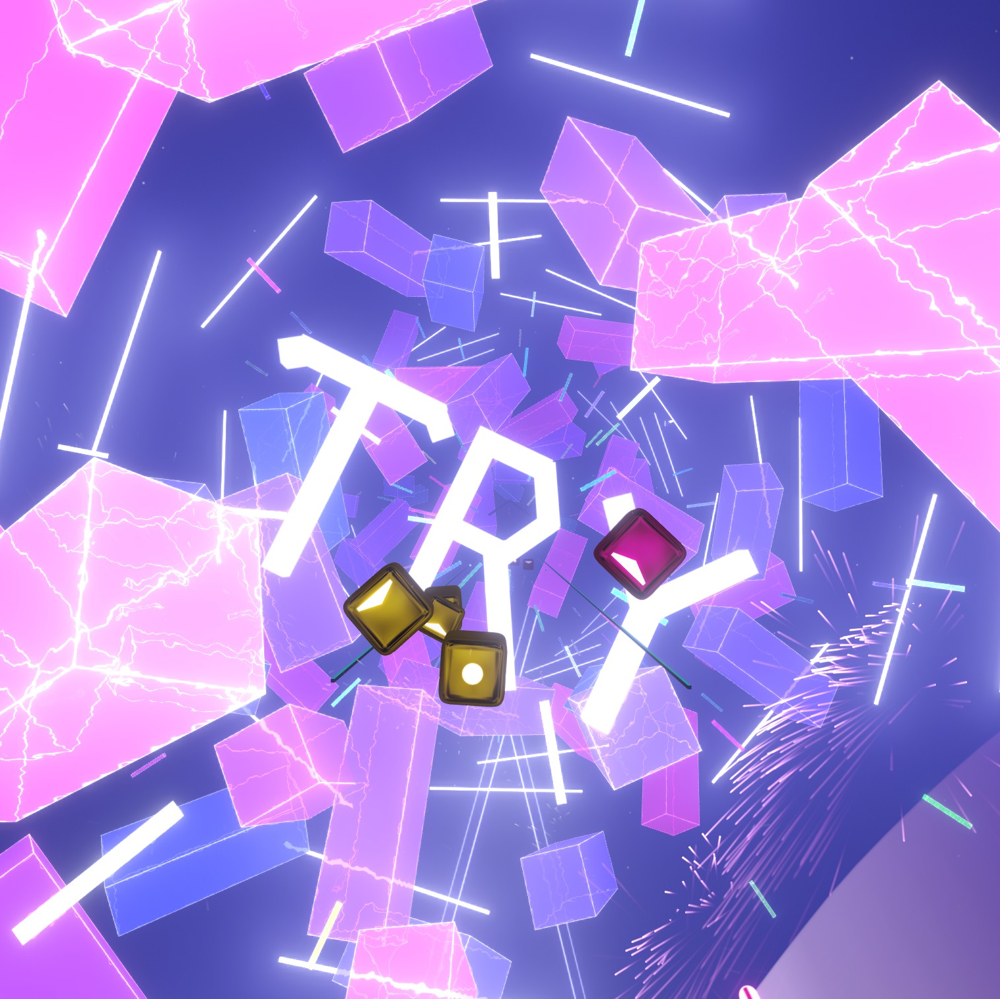
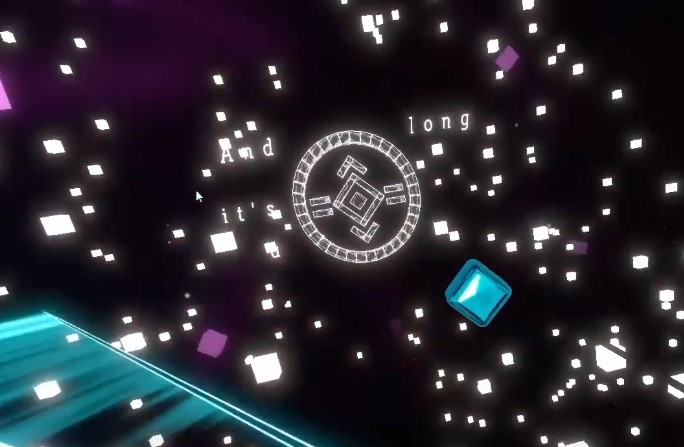
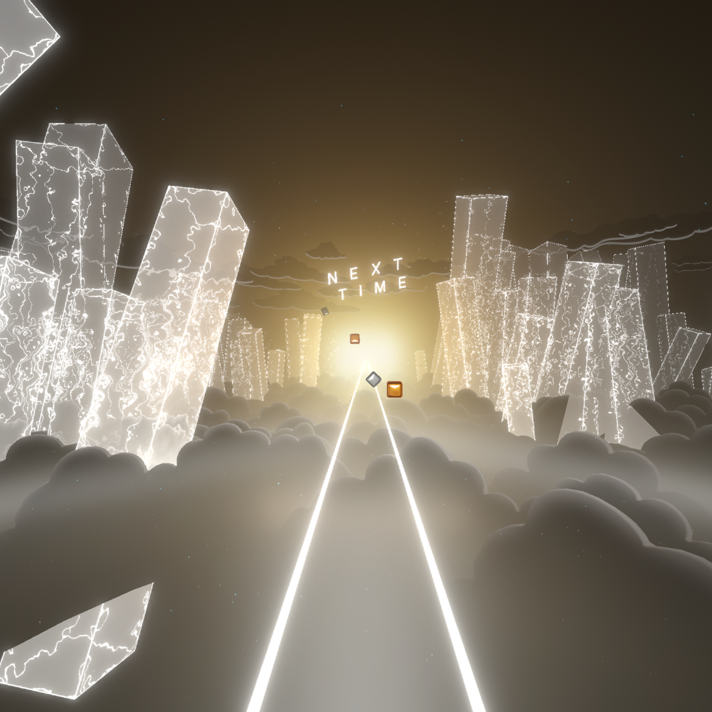

# ScuffedWalls (Deprecated)
```
ScuffedWalls is no longer under active developement. The quality of code being unworkable and the need from the beat saber community 
dying down makes this program officially deprecated. It is currently in a working state (just barely) and is still usable for wallmaps / notemaps.

I do not ever plan to remove ScuffedWalls from github. It is still special to me and to many others even if its a little scuffed.
- thelightdesigner (KyleT)

Changes are still welcome via pull requests and direct messages.
```


A command line tool designed as an alternative to scripting Noodle Extensions maps.

This tool does not do the same thing as [`Beatwalls`](https://github.com/spookyGh0st/beatwalls) from spookyGh0st.

## Quick Start
  - Place the program in the map folder or [`drag the map folder onto the .exe`](https://drive.google.com/file/d/154HyzH-xqE7AuoDrKM9p0_MZtH_f-F_r/view?usp=sharing)
  - Open the program
  - Follow the prompts until a `.sw` file is generated
  - Put your code in the generated `_ScuffedWalls.sw` file. 
  - Save the `_ScuffedWalls.sw` file to refresh the program.

## Documentation

 - **Intro and Setup video tutorial** by #Rizthesnuggie2634 -> [`right here`](https://youtu.be/RrcQRQfaXAI)
 - **Documentation** -> [`here`](Functions.md)
 - ModelToWall Specifics -> [`here`](Blender%20Project.md)
 - TextToWall Specifics -> [`here`](TextToWall.md)
 - Example Scripts And Effects -> [`here`](Example%20Functions.md)

 Rizthesnuggie's full intro documentation can be found [`here`](https://drive.google.com/drive/folders/1aAUuv8Ycmf2LdSRvKYhfThY2tQhZxFYS?usp=sharing)
 
 
*Windows will probably bother you about this being malware. If you dont trust it, clone the repo and build it yourself.*

If everything doesnt work and your in a country that uses , as the decimal symbol, [`changing regional settings`](Images/regional.png) is a common fix.

## Problems

The documentation is plentiful, yet not perfect. If you have questions feel free to DM us through Discord.
 - DM `thelightdesigner#0832` for questions AND bugs
 - DM `iswimfly#0556` for questions
 - Join the Noodle Extensions Discord: https://discord.gg/d3JSR4kBD6

Also you can create Issues through github if you want.

## Example Maps

 - [`Phototropic`](https://www.youtube.com/watch?v=Bp1w2SPBRHE)
 - [`Overthinker`](https://www.youtube.com/watch?v=PYvPg2J73Jw)
 - [`Centipede`](https://www.youtube.com/watch?v=rkcK2gJZTfs&t=82s)
 - [`Shelter`](https://www.youtube.com/watch?v=a4zSCDYRwAQ)
 - [`Illuminate`](https://www.youtube.com/watch?v=lFL3Gjy15oc&t=1s)
 - [`Homesick`](https://www.youtube.com/watch?v=St3fSqj8SXc)
 - [`Gamecube Intro`](https://www.youtube.com/watch?v=0SVRM0cmUVE)
 - [`Try`](https://www.youtube.com/watch?v=fO4Z6OG5w_I)
 - [`Real or Lie`](https://www.youtube.com/watch?v=59X3Qb78-Es)
 - [`Exosphere`](https://www.youtube.com/watch?v=698L0vSI0no)
 - [`Rare`](https://www.youtube.com/watch?v=fQpDYL0If7U)
 - [`Wait`](https://www.youtube.com/watch?v=FLstEOwle08)
 - [`Giant Enemy Spider`](https://www.youtube.com/watch?v=SntUgEmF9UQ)
 - [`0108ROCKET`](https://www.youtube.com/watch?v=YtHnIqrLW1s)
 - [`Dadadada`](https://www.youtube.com/watch?v=vJlGANqWn2U)
 - [`Scary Garry`](https://www.youtube.com/watch?v=Pw5GfyzEWNU)
 - [`Industry Baby`](https://www.youtube.com/watch?v=vtNGsJnHRD4)
 - [`Last Christmas`](https://www.youtube.com/watch?v=kcKMgOnlyis)
 - [`Crystallized`](https://youtu.be/TnvvoApz4zg)
 - [`Wasted`](https://www.youtube.com/watch?v=TTqqOfxKLEI)
 - [`Don't Wanna Fall`](https://youtu.be/unjtFxjYHH4)
 - [`Let it Rain`](https://youtu.be/sQUd3LIQP1M)
 - [`Reassurance`](https://www.youtube.com/watch?v=c5mail8zQjo)
 - [`Form`](https://www.youtube.com/watch?v=zZuZibgRMkg)
 - `Rolls Royce - Tisoki & Grabbitz (Renycs)`
 - `Take A Chance - Flume (Renycs)`
 - `My Boy (Troyboy Remix) - Billie Eilish (Renycs)`
 - `Jaws theme song (wobbleorange)`
 - `A1 - It's Just A Burning Memory (GojiCrafter)`
 - `secret base ~Kimi ga Kureta Mono (iswimfly)`








# Alternative Tools

## Remapper


**This is a good alternative to ScuffedWalls!!**

[`Click Here`](https://github.com/Swifter1243/ReMapper)

a [TypeScript](https://www.typescriptlang.org/) library designed to help
with making Beat Saber modcharts. It is designed to optimize the scripting
experience, and reduce code to be very minimal, and sometimes single lines.

**Features**

- Wrappers for Notes, Walls, Events, Custom Events, and Environment Objects.
- Class for handling colors (you can make pretty rainbows!!!).
- Wrapper for optimizing and managing animations.
- Blender Model Exporting
  - Switch environments
  - Supports animations
  - Compatible with any environment piece (including multiple at once!)
- LightID remapping tools.
- Difficulty and Info.dat wrappers.
- Various random useful functions.
- Much more!!!

## For Developers

-> ask thelighdesigner
